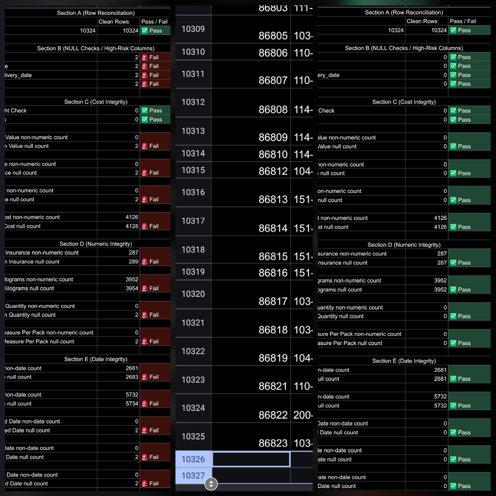

# Analysis Log — SCMS Delivery History

## 2026-01-17
- Ingested SCMS_Delivery_History_Dataset.csv from Kaggle
- Identified non-date values in PO date field (e.g., "Date Not Captured")
- Implemented cleaned date columns with NULL handling
- Built generic date validation checks using DATEVALUE logic

## 2026-01-18
- Implemented numeric validation checks for quantity and cost fields
- Created cleaned numeric columns using VALUE() coercion
- Added delivery timing classification (Early / On Time / Late)
- Implemented date integrity checks:
  - Delivered ≥ PO
  - Recorded ≥ Delivered
  - Delay days sanity bounds

## 2026-01-19
- Continued implementation of validation checks for quantity and cost fields
- Added date fields to check non date entires and null counts
- Validation checks read 🚨 Fail (2 rows in question)
- Cleaned_Data.csv has 2 extra rows at bottom of sheet 
  - Deleted rows 10326 & 10327
  - Validation checks all ✅️ Pass

<!-- ===================== -->
<!--        PREVIEW        -->
<!-- ===================== -->

## 2026-01-20
- Created KPI Fields & Calculations
  - total_shipments
  - on_time_delivery_pct
  - avg_delivery_delay_days
  - total_logistics_cost
  - cost_per_unit
  - late_shipment_rate
  - avg_freight_cost_first_line
- Updated Validation Checks 
- Created Pivot Exploration sheet and inserted Pivot Charts

## 2026-01-21
- Connected Cleaned_Data.csv to Tableau Workbook
- Created Calculated Fields
  - on_time_flag
  - delivery_delay_days
  - total_logistics_cost
  - cost_per_unit
  - first_line_designation
- Created Worksheets for Dashboard
  - KPI_Tiles
  - OnTime_by_Mode
  - OnTime_by_Vendor
  - Country_Performance
  - Cost_vs_Reliability
- Calculations review and check

## 2026-01-22
- Created & finalized Tableau Dashboard layout
- Created & finalized Tableau Story points
- Filters Test / Calculations Check 
- Write riugh draft of Executive Answer 

## 2026-01-23
- Write Executive Answer final draft
- Created Key Insights file
- Created Tools Used File

