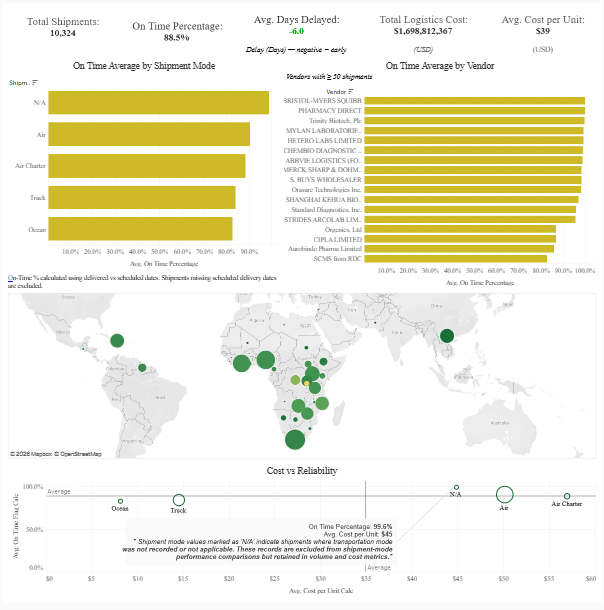

# 📦 3PL Supply Chain Analysis  
## Shipment Pricing, Reliability, and Cost Tradeoffs

Third-party logistics providers face a constant tradeoff:  
**improve on-time delivery without defaulting to expensive transportation modes.**

This project analyzes **real shipment pricing and delivery data** to understand how:

- 🚚 **Shipment mode**
- 🏭 **Vendor operations**
- 🌍 **Geography**

influence **delivery reliability**, **delivery timing**, and **logistics cost** — and where targeted 3PL interventions can deliver the **highest reliability gains per dollar spent**.

Rather than treating speed and cost as a binary choice, this analysis identifies **where selective rebalancing** (vendors, lanes, and shipment modes) can improve SLA performance **without disproportionately increasing logistics spend**.

---

## 🎯 Business Question

**Where can a third-party logistics provider intervene to improve delivery reliability without defaulting to higher-cost shipment modes?**

---

## 📊 What This Project Delivers

- Cleaned, analysis-ready shipment pricing dataset  
- KPI-driven evaluation of SLA performance and cost efficiency  
- Shipment mode reliability vs cost tradeoff analysis  
- Vendor-level and country-level risk identification  
- Executive-ready Tableau dashboards and presentation  
- Fully reproducible analysis pipeline (code + documentation)

---

## 🧠 Executive Insight (At a Glance)

> Air shipments deliver the highest reliability but at a significant cost premium.  
> High-volume truck lanes and vendor coverage gaps represent the **largest opportunity** for reliability improvement without defaulting to air freight.

---

## 🔗 Related Project Links

- 📦 **Dataset:** *Supply Chain Shipment Pricing Data* (Kaggle)  
- 📓 **Analysis Notebook:** *Clean_and_analyze.py* (Kaggle)  
- 💻 **Reproducible Code & Assets:** This repository

---

⬇️ Continue below for dashboards, analysis workflow, datasets, and executive deliverables.

---

## **Business Problem**

 How do shipment mode, vendor operations, and geography influence on-time delivery performance and logistics cost, and where can a third-party logistics provider intervene to improve reliability without disproportionately increasing transportation spend?


## **Executive Answer**

  Excluding N/A shipment mode, the On-Time percentage is 88.1% at a -6.2 Days delayed. While these numbers mean that shipments are expected to arrive about 6 days early, this may harm SLAs and cause distrust amongst customers who may find estimated delivery dates "unreliable".

  The bulk of shipments are through Air with over 6,000 shipments at a 90.4 on time percentage delayed -3.8 days, which is not bad. Although, at an average unit cost of $50 USD, Air shipment is not very cost effective. Ocean shipments are the least reliable with 83.5% on-time average 5.9 days delayed, however, at just $8 USD per unit this is the cheapest method. Trucks are the second cheapest shipment mode at $15 USD per unit. Trucks are also the second riskiest mode at 83.9% on-time average at -9.9 days delayed. Since truck shipping is the second most used shipment mode at 2,830 shipments, this is where a third-party logistics provider can intervene.

  The riskiest shipments are centered around the African region and there are only 2 vendors that use truck shipments inside of Africa. By adding 1 or 2 more third-party trucking providers SCMS can increase their on-time average and trade off some of their expensive air shipments with more costly truck shipments.

---

## 📊 **Tableau**
Interactive dashboard and guided story used to analyze delivery performance, cost drivers, and SLA risk across shipment modes, vendors, and regions.

<!-- ===================== -->
<!--        BANNER         -->
<!-- ===================== -->


### Dashboard

[](https://public.tableau.com/app/profile/sawandi.kirby/viz/SCMS_Delivery_History_Dashboard/SCMS_Delivery_History_Dashboard)  

### Story

[](https://public.tableau.com/app/profile/sawandi.kirby/viz/SCMS_Delivery_History_Story/SCMS_Delivery_History_Story)  

---

## 🗃️ **Dataset**
Public shipment pricing and delivery data used to analyze cost, delay patterns, and operational trade-offs in a 3PL context.

### Source
[](https://www.kaggle.com/datasets/divyeshardeshana/supply-chain-shipment-pricing-data/data)  

*Author: Divyesh Ardeshana*

### Raw

[](https://github.com/visualkirby/3PL-Supply-Chain-Analysis/blob/main/Raw_Data.csv)

*Original dataset as published, prior to cleaning or transformation.*

### Processed

[](https://github.com/visualkirby/3PL-Supply-Chain-Analysis/blob/main/Cleaned_Data.csv)

*Cleaned and analysis-ready dataset with standardized fields and derived metrics.*

---

## 👨🏿‍💻 **Analysis**
Analytical workflow used to clean the data, explore delivery and cost drivers, define KPIs, and surface actionable insights.

### Code

[](https://github.com/visualkirby/3PL-Supply-Chain-Analysis/blob/main/KPIs.md)

[](https://github.com/visualkirby/3PL-Supply-Chain-Analysis/blob/main/clean_and_analyze.sql)

[](https://github.com/visualkirby/3PL-Supply-Chain-Analysis/blob/main/shipment_pipeline.py)

[](https://github.com/visualkirby/3PL-Supply-Chain-Analysis/blob/main/KPIs.md)

### KPIs

[](https://github.com/visualkirby/3PL-Supply-Chain-Analysis/blob/main/KPIs.md)

[](https://github.com/visualkirby/3PL-Supply-Chain-Analysis/blob/main/KPI_Calculations.csv) 

*Primary performance metrics used to evaluate delivery reliability, cost efficiency, and SLA risk.*

### Tools Used

[](https://github.com/visualkirby/3PL-Supply-Chain-Analysis/blob/main/tools_used.md)

### Key Insights

[](https://github.com/visualkirby/3PL-Supply-Chain-Analysis/blob/main/key_insights.md) 

*Summary of findings with direct implications for 3PL operational and pricing decisions.*

---

## 🖥️ **Presentation**
Executive-style presentation summarizing the business problem, analytical approach, key findings, and recommendations for improving delivery reliability while controlling logistics spend.

### PDF

[](https://github.com/visualkirby/3PL-Supply-Chain-Analysis/blob/main/SCMS_Delivery_History_Presentation.pdf)

### PowerPoint

[](https://github.com/visualkirby/3PL-Supply-Chain-Analysis/blob/main/SCMS_Delivery_History_Presentation.pptx)

---

## 📂 **Docs**
Supporting documentation defining data fields, business rules, validation logic, and analytical assumptions used throughout the project.

[](https://github.com/visualkirby/3PL-Supply-Chain-Analysis/blob/main/data_dictionary.md)

[](https://github.com/visualkirby/3PL-Supply-Chain-Analysis/blob/main/Business%20Rules.md)

[](https://github.com/visualkirby/3PL-Supply-Chain-Analysis/blob/main/Validation_Checks.csv)

---

## 🗓 **Logs**
Chronological record of analysis steps, decisions, and revisions made during the project lifecycle.

[](https://github.com/visualkirby/3PL-Supply-Chain-Analysis/blob/main/Analysis%20Log.md)

---

## 🗂 File Structure

```txt
3PL-Supply-Chain-Analysis/
│
├── README.md
│
├── Business Problem
├── Executive Answer 
│
├── Tableau/
│   ├── Dashboard Screenshot
│   └── SCMS Delivery History Dashboard
│   └── SCMS Delivery History Story
│
├── Dataset/
│   ├── Source/
│   │   └── Original Kaggle Dataset
│   ├── Raw/
│   │   └── Raw_Data.csv
│   ├── Processed/
│   │   └── Cleaned_Data.csv
│
├── Analysis/
│   ├── Code/
│   │   └── Python Kagge Notebook
│   │   └── clean_and_analyze.py
│   │   └── clean_and_analyze.Rmd
│   ├── KPIs/
│   │   └── KPIs.md
│   │   └── KPI_calculations.csv
│   ├── Tools Used
│   │   └── tools_used.md
│   ├── Key Insights
│   │   └── key_insights.md
│
├── Presentation/
│   └── SCMS_Delivery_History.pdf
│   └── SCMS_Delivery_History.pptx
│
├── Docs/
│   └── assumptions.md
│   └── data_dictionary.md
│   └── business_rules.md
│   └── validation_checks.csv
│
└── Logs/
    └── analysis_log.md
